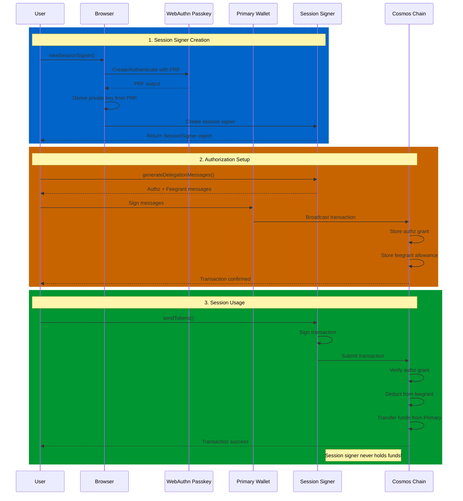

# Stint

[](https://codecov.io/gh/n2p5/stint)
[](https://snyk.io/test/github/n2p5/stint)

Short-lived, non-custodial passkey based session signers for the Cosmos SDK ecosystem.

> **⚠️ EXPERIMENTAL SOFTWARE WARNING**
> 
> **This project is experimental and has NOT undergone a security audit.** Use at your own risk and only with funds you can afford to lose. Do not use in production environments or with significant amounts of cryptocurrency.
> 
> - This software is provided "as is" without warranty of any kind
> - No security audit has been conducted
> - There may be undiscovered vulnerabilities
> - Consider this alpha/beta software suitable for testing only
> 
> Please review the code thoroughly before use and consider having it audited by security professionals before any production deployment.

## Overview

Stint enables users to create ephemeral session signers that can perform limited blockchain actions without requiring constant hardware wallet interaction. The system uses Cosmos SDK's `authz` and `feegrant` modules combined with WebAuthn Passkeys for secure, deterministic key derivation.

## Why would I want this?

A session signer, when narrowly scoped, can be useful for simplifying the User Experience (UX) for for social dApps that use a low fee and gas structure for on-chain interactivity.

- **Social media interactions**: Enable users to "like", "repost", or comment on-chain without signing popups
- **Profile and settings updates**: Make small changes to on-chain profiles or preferences seamlessly
- **Gaming and play-to-earn**: Allow in-game actions like moves, item trades, or achievement claims without interrupting gameplay
- **Recurring payments or tips**: Set up limited spending for content creators, subscriptions, or micro-donations
- **DAO participation**: Vote on a set of proposals without hardware wallet interaction for each vote

## Key Concept

The system works by creating a **session signer** that never holds funds but can transact on behalf of your primary signer:

1. **Passkey + PRF**: Creates a deterministic private key using WebAuthn Passkey with PRF extension
2. **Authz Grant**: Primary signer authorizes session signer to perform specific actions (e.g., Send messages) with defined limits  
3. **Feegrant**: Primary signer grants fee allowance to session signer, so it doesn't need to hold any funds for gas

## Features

- 🔑 **Passkey-based key derivation** - Uses WebAuthn PRF extension for deterministic, secure key generation
- 🔐 **Non-custodial** - Session signer address never hold funds, all gas is covered by feegrants
- ⚡ **Seamless UX** - Sign transactions without hardware wallet popups for authorized actions  
- 🚀 **Zero balance required** - Session signer works without any token balance
- 🌐 **Multi-wallet support** - Works with Keplr, Leap, Cosmostation, and potentially any Cosmos wallet
- 📦 **Framework agnostic** - Works in browsers and React Native environments

## Installation

```bash
npm install stint-signer
# or
pnpm add stint-signer
# or
yarn add stint-signer
```

## Quick Start

```typescript
import { newSessionSigner } from 'stint-signer'
import { SigningStargateClient } from '@cosmjs/stargate'

// 1. Create session signer
const sessionSigner = await newSessionSigner({
  primaryClient,  // Your existing SigningStargateClient
  saltName: 'my-app' // optional, defaults to 'stint-session'
})

// 2. Check existing grants (optional)
const hasAuthz = await sessionSigner.hasAuthzGrant()
const hasFeegrant = await sessionSigner.hasFeegrant()

// 3. Generate ready-to-broadcast delegation messages
const authorizedRecipient = 'cosmos1recipient123...'
const setupMessages = sessionSigner.generateDelegationMessages({
  sessionExpiration: new Date(Date.now() + 24 * 60 * 60 * 1000), // 24 hours
  spendLimit: { denom: 'uatom', amount: '1000000' },   // 1 ATOM spending limit (can be uatom or uphoton)
  gasLimit: { denom: 'uphoton', amount: '500000' },    // 0.5 PHOTON gas limit (must be uphoton in AtomOne)
  allowedRecipients: [authorizedRecipient] // Restrict to specific recipient only
})

// 4. Broadcast setup transaction with your primary signer

const primaryAddress = sessionSigner.primaryAddress()
await primaryClient.signAndBroadcast(primaryAddress, setupMessages, 'auto')

// 5. Use session signer to send transactions!
await sessionSigner.client.sendTokens(
  sessionSigner.primaryAddress(), // Funds come from primary signer
  authorizedRecipient, // Must match allowedRecipients from step 3
  [{ denom: 'uatom', amount: '100000' }], // 0.1 ATOM
  'auto',
  'Sent via session signer'
)
// ✅ Session signer address never held funds
// ✅ Gas fees automatically paid via feegrant  
// ✅ Transaction authorized within limits
```

## Complete Flow Example

Here's a complete example showing how to set up a session signer and send a transaction on behalf of the primary signer:

```typescript
import { newSessionSigner } from 'stint-signer'
import { SigningStargateClient } from '@cosmjs/stargate'

async function stintExample() {
  // 1. Create session signer (triggers passkey creation/authentication)
  const sessionSigner = await newSessionSigner({
    primaryClient,  // Your existing SigningStargateClient
    saltName: 'my-app-trading'  // Optional: creates isolated session signer
  })

  const primaryAddress = sessionSigner.primaryAddress()
  const sessionAddress = sessionSigner.sessionAddress()
  
  console.log(`Primary address: ${primaryAddress}`)
  console.log(`Session address: ${sessionAddress}`)

  // 2. Check if authorizations already exist (optional)
  const existingAuthz = await sessionSigner.hasAuthzGrant()
  const existingFeegrant = await sessionSigner.hasFeegrant()
  
  // 3. Define authorized recipient for restrictions
  const authorizedRecipient = 'cosmos1isolatedaccountxyz123...'
  
  if (!existingAuthz || !existingFeegrant) {
    // Generate ready-to-broadcast authorization messages with account scope restriction
    const setupMessages = sessionSigner.generateDelegationMessages({
      sessionExpiration: new Date(Date.now() + 24 * 60 * 60 * 1000), // 24 hours
      spendLimit: { denom: 'uphoton', amount: '500000' }, // Max 0.5 PHOTON for sending
      gasLimit: { denom: 'uphoton', amount: '500000' },  // 0.5 PHOTON for gas
      allowedRecipients: [authorizedRecipient] // Restrict to specific recipient
    // 4. Authorize with primary signer (ready-to-broadcast messages)
    })

    // 4. Authorize with primary signer (ready-to-broadcast messages)
    console.log('Setting up session signer authorizations...')
    const setupResult = await primaryClient.signAndBroadcast(
      primaryAddress, 
      setupMessages, 
      'auto'
    )
    
    console.log('Setup successful:', setupResult.transactionHash)
  } else {
    console.log('Session signer already authorized!')
  }

  // 5. Use session signer client to send funds on behalf of primary address
  const sendAmount = [{ denom: 'uatom', amount: '500000' }] // 0.5 ATOM (within limits)

  console.log('Sending transaction via session signer...')
  
  // Session signer client sends funds with memo (gas fees automatically covered by feegrant)
  const sendResult = await sessionSigner.client.sendTokens(
    sessionSigner.primaryAddress(), // Funds come from primary address
    authorizedRecipient, // Must match allowedRecipients from authorization
    sendAmount,
    'auto',
    'Sent via Stint session signer 🚀' // Optional memo
  )

  console.log('Transaction successful:', sendResult.transactionHash)
  console.log('Funds transferred from primary to isolated account!')

  // The session signer:
  // ✅ Never held any funds
  // ✅ Sent transaction on behalf of primary address  
  // ✅ Gas fees automatically paid from primary address via feegrant
  // ✅ Restricted to authorized recipient only
  // ✅ Limited to authorized spending amount
}

// Run the example
stintExample().catch(console.error)
```

### Key Benefits Demonstrated

- **Zero-balance operation**: Session signer never needs funds
- **Automatic gas payment**: Feegrant covers all transaction fees
- **Scope restrictions**: Limited to specific recipients and amounts
- **Seamless UX**: No hardware wallet popups after initial setup
- **Security**: Passkey-based deterministic key derivation
- **Revocable**: Primary signer maintains full control

## Examples

See the [examples](./examples) directory for complete working examples:

- [Dither Post Demo](./examples/dither-post-demo) - Full Flow example of session signer creation with posting on Dither

## Development

```bash
# Install dependencies
pnpm install

# Build library
pnpm build

# Run in watch mode
pnpm dev

# Run example with hot reload
pnpm dev:example

# Type check
pnpm typecheck

# Lint
pnpm lint

# Format code
pnpm format

# Run tests
pnpm test

# Run tests with coverage
pnpm test:coverage

# Run tests with UI
pnpm test:ui
```

## How It Works

The Stint session signer system combines WebAuthn passkeys with Cosmos SDK's authz and feegrant modules to enable secure, non-custodial session signing:



### Detailed Flow

1. **Passkey Creation**: Uses WebAuthn to create a passkey with PRF extension linked to your primary signer address
2. **Key Derivation**: Derives a deterministic private key from the passkey PRF output using a configurable salt
3. **Session Signer**: Creates an ephemeral signer from the derived key that never holds funds
4. **Authorization Setup**: Creates both authz grant and feegrant in a single transaction:
   - **Authz Grant**: Primary signer authorizes session signer for specific actions (e.g., Send) with spending limits
   - **Feegrant**: Primary signer grants fee allowance so session signer can pay for gas
5. **Seamless Usage**: Session signer can now sign and send transactions within authorized limits without any balance

## API Reference

### `newSessionSigner(config)`

Creates a new session signer with passkey-based key derivation.

```typescript
const sessionSigner = await newSessionSigner({
  primaryClient: SigningStargateClient,  // Required: Your primary address's client
  saltName?: string                      // Optional: Salt for key derivation (default: 'stint-session')
})
```

Returns a `SessionSigner` object with these methods:

- `client`: SigningStargateClient for the session signer (main interface for transactions)
- `primaryAddress()`: Get the primary signer address
- `sessionAddress()`: Get the session signer address  
- `generateDelegationMessages(config)`: Generate setup messages for authorization
- `hasAuthzGrant(messageType?)`: Check if authz grant exists
- `hasFeegrant()`: Check if feegrant exists
- `revokeDelegationMessages(msgTypeUrl?)`: Generate revocation messages (optional)

### Session Signer Methods

#### `sessionSigner.generateDelegationMessages(config)`

Generates ready-to-broadcast authz grant and feegrant messages to delegate authority to the session signer.

```typescript
const messages = sessionSigner.generateDelegationMessages({
  sessionExpiration?: Date,              // When the grants expire
  spendLimit?: { denom: string, amount: string },  // Max amount session signer can spend (uatom or uphoton)
  gasLimit?: { denom: string, amount: string },    // Max gas fees covered by feegrant (must be uphoton in AtomOne)
  allowedRecipients?: string[]           // Optional: restrict recipients
})

// messages is an array ready for signAndBroadcast:
await primaryClient.signAndBroadcast(primaryAddress, messages, 'auto')
```

**AtomOne Denomination Requirements:**
- `spendLimit.denom`: Can be `'uatom'` (ATOM) or `'uphoton'` (PHOTON)
- `gasLimit.denom`: Must be `'uphoton'` (PHOTON) - AtomOne requires fees in PHOTON
- Default values use `'uphoton'` for both spend and gas limits

#### `sessionSigner.revokeDelegationMessages(msgTypeUrl?)`

Generates ready-to-broadcast messages to revoke the delegated authority.

```typescript
const messages = sessionSigner.revokeDelegationMessages(
  '/cosmos.bank.v1beta1.MsgSend'  // Optional: message type to revoke (default: MsgSend)
)

// messages is an array ready for signAndBroadcast:
await primaryClient.signAndBroadcast(primaryAddress, messages, 'auto')
```

## Multiple Session Signers

You can create multiple session signers for different purposes using salt names:

```typescript
// Default session signer
const defaultSigner = await newSessionSigner({
  primaryClient,
})

// Trading-specific session signer  
const tradingSigner = await newSessionSigner({
  primaryClient,
  saltName: 'trading',
})

// Gaming-specific session signer
const gamingSigner = await newSessionSigner({
  primaryClient,
  saltName: 'gaming',
})
```

Each salt creates a completely different private key from the same passkey.

## Risks

When using session signers, be aware of these potential risks:

### High Spending Limits Without Recipient Restrictions
- **Risk**: Setting high `spendLimit` values without specifying `allowedRecipients` allows the session signer to send funds to ANY address
- **Impact**: If the session key is compromised, an attacker could drain funds up to the spending limit
- **Mitigation**: Always use `allowedRecipients` to restrict destinations, or keep spending limits minimal

### Excessive Fee Allowances
- **Risk**: Setting very high `gasLimit` values can allow a compromised session signer to waste funds on transaction fees
- **Impact**: Malicious or buggy code could burn through your fee allowance unnecessarily
- **Mitigation**: Set reasonable gas limits based on expected usage patterns

### Long Expiration Times
- **Risk**: Setting `sessionExpiration` far in the future increases the window of opportunity for attacks
- **Impact**: A compromised key remains dangerous for longer periods
- **Mitigation**: Use short expiration times (hours or days, not months) and renew as needed

### Passkey Compromise
- **Risk**: If your device or passkey is compromised, the attacker can recreate your session signer
- **Impact**: They gain the same permissions you granted to the session signer
- **Mitigation**: Revoke session signers immediately if device security is compromised

### Application-Level Vulnerabilities
- **Risk**: XSS, CSRF, or other web vulnerabilities could allow attackers to use your session signer
- **Impact**: Unauthorized transactions within your granted permissions
- **Mitigation**: Follow web security best practices and audit your application code

## Security Considerations

> **⚠️ CRITICAL: This software has NOT been security audited. Use only for testing and experimentation.**

- **Session signers are ephemeral** and should be treated as temporary
- **No funds at risk** - Session signers never hold any tokens, all gas is covered by feegrants
- **Configurable limits** - Set appropriate authorization limits and expiration times
- **Deterministic keys** - Private keys are derived deterministically from passkeys stored in secure hardware
- **Revocable** - Authorizations can be revoked at any time by the primary signer
- **Use testnets only** - Only use on testnets until this software has been thoroughly audited
- **Review code carefully** - Inspect all code before use in any environment with real value

## License

Unlicense (Public Domain)
