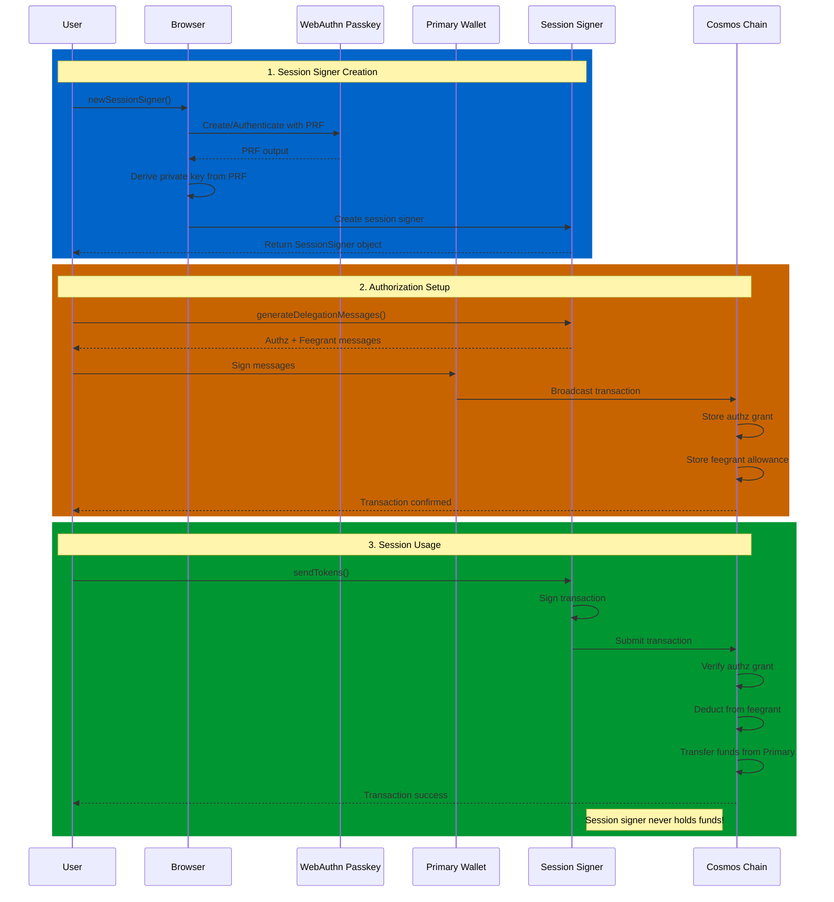

# Stint

[](https://www.npmjs.com/package/stint-signer)
[](https://codecov.io/gh/n2p5/stint)
[](https://snyk.io/test/github/n2p5/stint)

Short-lived, non-custodial passkey based session signers for the Cosmos SDK ecosystem.

> **⚠️ EXPERIMENTAL SOFTWARE WARNING**
>
> **This project is experimental and has NOT undergone a security audit.** Use at your own risk and only with funds you can afford to lose. Do not use in production environments or with significant amounts of cryptocurrency.
>
> - This software is provided "as is" without warranty of any kind
> - No security audit has been conducted
> - There may be undiscovered vulnerabilities
> - Consider this alpha/beta software suitable for testing only
>
> Please review the code thoroughly before use and consider having it audited by security professionals before any production deployment.

## Overview

Stint enables users to create ephemeral session signers that can perform limited blockchain actions without requiring constant hardware wallet interaction. The system uses Cosmos SDK's `authz` and `feegrant` modules combined with WebAuthn Passkeys for secure, deterministic key derivation.

## Why would I want this?

A session signer, when narrowly scoped, can be useful for simplifying the User Experience (UX) for for social dApps that use a low fee and gas structure for on-chain interactivity.

- **Social media interactions**: Enable users to "like", "repost", or comment on-chain without signing popups
- **Profile and settings updates**: Make small changes to on-chain profiles or preferences seamlessly
- **Gaming and play-to-earn**: Allow in-game actions like moves, item trades, or achievement claims without interrupting gameplay
- **Recurring payments or tips**: Set up limited spending for content creators, subscriptions, or micro-donations
- **DAO participation**: Vote on a set of proposals without hardware wallet interaction for each vote

## Key Concept

The system works by creating a **session signer** that never holds funds but can transact on behalf of your primary signer:

1. **Passkey + PRF**: Creates a deterministic private key using WebAuthn Passkey with PRF extension
2. **Authz Grant**: Primary signer authorizes session signer to perform specific actions (e.g., Send messages) with defined limits  
3. **Feegrant**: Primary signer grants fee allowance to session signer, so it doesn't need to hold any funds for gas

## Features

- 🔑 **Passkey-based key derivation** - Uses WebAuthn PRF extension for deterministic, secure key generation
- 🔐 **Non-custodial** - Session signer address never hold funds, all gas is covered by feegrants
- ⚡ **Seamless UX** - Sign transactions without hardware wallet popups for authorized actions  
- 🚀 **Zero balance required** - Session signer works without any token balance
- 🌐 **Multi-wallet support** - Works with Keplr, Leap, Cosmostation, and potentially any Cosmos wallet
- 📦 **Framework agnostic** - Works in browsers and React Native environments

## Installation

```bash
npm install stint-signer
# or
pnpm add stint-signer
# or
yarn add stint-signer
```

## Quick Start

```typescript
import { newSessionSigner } from 'stint-signer'
import { SigningStargateClient } from '@cosmjs/stargate'

// 1. Create session signer
const sessionSigner = await newSessionSigner({
  primaryClient,  // Your existing SigningStargateClient
  saltName: 'my-app' // optional, defaults to 'stint-session'
})

// 2. Check existing grants (optional)
const hasAuthz = await sessionSigner.hasAuthzGrant()
const hasFeegrant = await sessionSigner.hasFeegrant()

// 3. Generate ready-to-broadcast delegation messages
const authorizedRecipient = 'atone1recipient123...'
const setupMessages = sessionSigner.generateDelegationMessages({
  sessionExpiration: new Date(Date.now() + 24 * 60 * 60 * 1000), // 24 hours
  spendLimit: { denom: 'uphoton', amount: '1000000' },   // 1 PHOTON spending limit (can be uatom or uphoton)
  gasLimit: { denom: 'uphoton', amount: '500000' },    // 0.5 PHOTON gas limit (must be uphoton in AtomOne)
  allowedRecipients: [authorizedRecipient] // Restrict to specific recipient only
})

// 4. Broadcast setup transaction with your primary signer

const primaryAddress = sessionSigner.primaryAddress()
await primaryClient.signAndBroadcast(primaryAddress, setupMessages, 'auto')

// 5. Use session signer to send transactions!
await sessionSigner.client.sendTokens(
  sessionSigner.primaryAddress(), // Funds come from primary signer
  authorizedRecipient, // Must match allowedRecipients from step 3
  [{ denom: 'uphoton', amount: '100000' }], // 0.1 PHOTON
  'auto',
  'Sent via session signer'
)
// ✅ Session signer address never held funds
// ✅ Gas fees automatically paid via feegrant  
// ✅ Transaction authorized within limits
```

## Complete Flow Example

Here's a complete example showing how to set up a session signer and send a transaction on behalf of the primary signer:

```typescript
import { newSessionSigner } from 'stint-signer'
import { SigningStargateClient } from '@cosmjs/stargate'

async function stintExample() {
  // 1. Create session signer (triggers passkey creation/authentication)
  const sessionSigner = await newSessionSigner({
    primaryClient,  // Your existing SigningStargateClient
    saltName: 'my-app-trading'  // Optional: creates isolated session signer
  })

  const primaryAddress = sessionSigner.primaryAddress()
  const sessionAddress = sessionSigner.sessionAddress()
  
  console.log(`Primary address: ${primaryAddress}`)
  console.log(`Session address: ${sessionAddress}`)

  // 2. Check if authorizations already exist (optional)
  const existingAuthz = await sessionSigner.hasAuthzGrant()
  const existingFeegrant = await sessionSigner.hasFeegrant()
  
  // 3. Define authorized recipient for restrictions
  const authorizedRecipient = 'atone1isolatedaccountxyz123...'
  
  if (!existingAuthz || !existingFeegrant) {
    // Generate ready-to-broadcast authorization messages with account scope restriction
    const setupMessages = sessionSigner.generateDelegationMessages({
      sessionExpiration: new Date(Date.now() + 24 * 60 * 60 * 1000), // 24 hours
      spendLimit: { denom: 'uphoton', amount: '500000' }, // Max 0.5 PHOTON for sending
      gasLimit: { denom: 'uphoton', amount: '500000' },  // 0.5 PHOTON for gas
      allowedRecipients: [authorizedRecipient] // Restrict to specific recipient
    // 4. Authorize with primary signer (ready-to-broadcast messages)
    })

    // 4. Authorize with primary signer (ready-to-broadcast messages)
    console.log('Setting up session signer authorizations...')
    const setupResult = await primaryClient.signAndBroadcast(
      primaryAddress, 
      setupMessages, 
      'auto'
    )
    
    console.log('Setup successful:', setupResult.transactionHash)
  } else {
    console.log('Session signer already authorized!')
  }

  // 5. Use session signer client to send funds on behalf of primary address
  const sendAmount = [{ denom: 'uphoton', amount: '500000' }] // 0.5 PHOTON (within limits)

  console.log('Sending transaction via session signer...')
  
  // Session signer client sends funds with memo (gas fees automatically covered by feegrant)
  const sendResult = await sessionSigner.client.sendTokens(
    sessionSigner.primaryAddress(), // Funds come from primary address
    authorizedRecipient, // Must match allowedRecipients from authorization
    sendAmount,
    'auto',
    'Sent via Stint session signer 🚀' // Optional memo
  )

  console.log('Transaction successful:', sendResult.transactionHash)
  console.log('Funds transferred from primary to isolated account!')

  // The session signer:
  // ✅ Never held any funds
  // ✅ Sent transaction on behalf of primary address  
  // ✅ Gas fees automatically paid from primary address via feegrant
  // ✅ Restricted to authorized recipient only
  // ✅ Limited to authorized spending amount
}

// Run the example
stintExample().catch(console.error)
```

### Key Benefits Demonstrated

- **Zero-balance operation**: Session signer never needs funds
- **Automatic gas payment**: Feegrant covers all transaction fees
- **Scope restrictions**: Limited to specific recipients and amounts
- **Seamless UX**: No hardware wallet popups after initial setup
- **Security**: Passkey-based deterministic key derivation
- **Revocable**: Primary signer maintains full control

## Examples

See the [examples](./examples) directory for complete working examples:

- [Dither Post Demo](./examples/dither-post-demo) - Full Flow example of session signer creation with posting on Dither

## Development

```bash
# Install dependencies
pnpm install

# Build library
pnpm build

# Run in watch mode
pnpm dev

# Run example with hot reload
pnpm dev:example

# Type check
pnpm typecheck

# Lint
pnpm lint

# Format code
pnpm format

# Run tests
pnpm test

# Run tests with coverage
pnpm test:coverage

# Run tests with UI
pnpm test:ui
```

## How It Works

The Stint session signer system combines WebAuthn passkeys with Cosmos SDK's authz and feegrant modules to enable secure, non-custodial session signing:



### Detailed Flow

1. **Passkey Creation**: Uses WebAuthn to create a passkey with PRF extension linked to your primary signer address
2. **Key Derivation**: Derives a deterministic private key from the passkey PRF output using a configurable salt
3. **Session Signer**: Creates an ephemeral signer from the derived key that never holds funds
4. **Authorization Setup**: Creates both authz grant and feegrant in a single transaction:
   - **Authz Grant**: Primary signer authorizes session signer for specific actions (e.g., Send) with spending limits
   - **Feegrant**: Primary signer grants fee allowance so session signer can pay for gas
5. **Seamless Usage**: Session signer can now sign and send transactions within authorized limits without any balance

## API Reference

### `newSessionSigner(config)`

Creates a new session signer with passkey-based key derivation.

```typescript
import { newSessionSigner, type Logger } from 'stint-signer'

const sessionSigner = await newSessionSigner({
  primaryClient: SigningStargateClient,  // Required: Your primary address's client
  saltName?: string,                     // Optional: Salt for key derivation (default: 'stint-session')
  logger?: Logger                        // Optional: Custom logger (default: no logging)
})
```

Returns a `SessionSigner` object with these methods:

- `client`: SigningStargateClient for the session signer (main interface for transactions)
- `primaryAddress()`: Get the primary signer address
- `sessionAddress()`: Get the session signer address  
- `generateDelegationMessages(config)`: Generate setup messages for authorization
- `generateConditionalDelegationMessages(config)`: Generate messages only for missing grants
- `hasAuthzGrant(messageType?)`: Check if authz grant exists
- `hasFeegrant()`: Check if feegrant exists
- `revokeDelegationMessages(msgTypeUrl?)`: Generate revocation messages (optional)

### Available Exports

```typescript
// Main functions
import { newSessionSigner } from 'stint-signer'

// Error handling  
import { StintError, ErrorCodes, type ErrorCode } from 'stint-signer'

// Logging
import { consoleLogger, type Logger } from 'stint-signer'

// TypeScript types
import type { 
  SessionSigner, 
  SessionSignerConfig, 
  DelegationConfig,
  AuthzGrantInfo,
  FeegrantInfo
} from 'stint-signer'
```

### Session Signer Methods

#### `sessionSigner.generateDelegationMessages(config)`

Generates ready-to-broadcast authz grant and feegrant messages to delegate authority to the session signer.

```typescript
const messages = sessionSigner.generateDelegationMessages({
  sessionExpiration?: Date,              // When the grants expire
  spendLimit?: { denom: string, amount: string },  // Max amount session signer can spend (uatom or uphoton)
  gasLimit?: { denom: string, amount: string },    // Max gas fees covered by feegrant (must be uphoton in AtomOne)
  allowedRecipients?: string[]           // Optional: restrict recipients
})

// messages is an array ready for signAndBroadcast:
await primaryClient.signAndBroadcast(primaryAddress, messages, 'auto')
```

**AtomOne Denomination Requirements:**
- `spendLimit.denom`: Can be `'uatom'` (ATOM) or `'uphoton'` (PHOTON)
- `gasLimit.denom`: Must be `'uphoton'` (PHOTON) - AtomOne requires fees in PHOTON
- Default values use `'uphoton'` for both spend and gas limits

#### `sessionSigner.generateConditionalDelegationMessages(config)`

Similar to `generateDelegationMessages`, but only generates messages for grants that don't already exist. This is more efficient when you want to avoid duplicate grants.

```typescript
const messages = await sessionSigner.generateConditionalDelegationMessages({
  sessionExpiration?: Date,              // When the grants expire
  spendLimit?: { denom: string, amount: string },  // Max amount session signer can spend
  gasLimit?: { denom: string, amount: string },    // Max gas fees covered by feegrant
  allowedRecipients?: string[]           // Optional: restrict recipients
})

// messages will be empty if both grants already exist
if (messages.length > 0) {
  await primaryClient.signAndBroadcast(primaryAddress, messages, 'auto')
} else {
  console.log('All grants already exist!')
}
```

This method automatically checks for existing grants and only includes the missing ones in the returned message array.

#### `sessionSigner.revokeDelegationMessages(msgTypeUrl?)`

Generates ready-to-broadcast messages to revoke the delegated authority.

```typescript
const messages = sessionSigner.revokeDelegationMessages(
  '/cosmos.bank.v1beta1.MsgSend'  // Optional: message type to revoke (default: MsgSend)
)

// messages is an array ready for signAndBroadcast:
await primaryClient.signAndBroadcast(primaryAddress, messages, 'auto')
```

## Multiple Session Signers

You can create multiple session signers for different purposes using salt names:

```typescript
// Default session signer
const defaultSigner = await newSessionSigner({
  primaryClient,
})

// Trading-specific session signer  
const tradingSigner = await newSessionSigner({
  primaryClient,
  saltName: 'trading',
})

// Gaming-specific session signer
const gamingSigner = await newSessionSigner({
  primaryClient,
  saltName: 'gaming',
})
```

Each salt creates a completely different private key from the same passkey.

## Extended Guide

### Custom Logging

Stint includes a comprehensive logging system to help you debug and monitor session signer operations. You can provide your own logger implementation or use the built-in options.

#### Using Built-in Loggers

```typescript
import { newSessionSigner, consoleLogger } from 'stint-signer'

// Default behavior - no logging
const sessionSigner = await newSessionSigner({
  primaryClient
})

// Enable console logging for debugging
const sessionSigner = await newSessionSigner({
  primaryClient,
  logger: consoleLogger
})
```

#### Custom Logger Implementation

```typescript
import { newSessionSigner, type Logger } from 'stint-signer'

// Implement your own logger
const customLogger: Logger = {
  debug: (message: string, context?: Record<string, unknown>) => {
    // Send to your debugging service
    debugService.log('debug', message, context)
  },
  info: (message: string, context?: Record<string, unknown>) => {
    // Send to your analytics
    analytics.track(message, context)
  },
  warn: (message: string, context?: Record<string, unknown>) => {
    // Send to warning monitoring
    warningService.report(message, context)
  },
  error: (message: string, error?: Error, context?: Record<string, unknown>) => {
    // Send to error tracking (Sentry, etc.)
    errorTracker.captureException(error || new Error(message), {
      tags: { component: 'stint-signer' },
      extra: context
    })
  }
}

const sessionSigner = await newSessionSigner({
  primaryClient,
  logger: customLogger
})
```

#### What Gets Logged

The logger captures important events throughout the session signer lifecycle:

- **Session creation**: Passkey operations, key derivation progress
- **Grant checking**: Network requests for existing authz/feegrant status
- **Transaction operations**: Message generation and broadcasting
- **Error conditions**: Network failures, validation errors, WebAuthn issues

Example log output:
```
[Stint] Initializing session signer { saltName: 'my-app' }
[Stint] Starting passkey derivation { address: 'atone1abc...', saltName: 'my-app' }  
[Stint] Session key ready
[Stint] Checking authz grant { messageType: '/cosmos.bank.v1beta1.MsgSend' }
[Stint] Found authz grant { hasExpiration: true }
```

### Error Handling

Stint provides structured error handling with specific error codes for different failure scenarios.

#### Error Types

```typescript
import { StintError, ErrorCodes } from 'stint-signer'

try {
  const sessionSigner = await newSessionSigner({ primaryClient })
} catch (error) {
  if (error instanceof StintError) {
    switch (error.code) {
      case ErrorCodes.WEBAUTHN_NOT_SUPPORTED:
        console.log('WebAuthn not available in this browser')
        // Fallback to hardware wallet only
        break
        
      case ErrorCodes.PASSKEY_CREATION_FAILED:
        console.log('User cancelled passkey creation')
        // Show user-friendly message
        break
        
      case ErrorCodes.PRF_NOT_SUPPORTED:
        console.log('Passkey does not support PRF extension')
        // Inform user about browser/device limitations
        break
        
      case ErrorCodes.USER_CANCELLED:
        console.log('User cancelled the operation')
        // No action needed
        break
        
      case ErrorCodes.INVALID_RPC_URL:
        console.log('Invalid RPC URL provided')
        // Check your configuration
        break
        
      default:
        console.log('Unknown stint error:', error.message)
    }
    
    // Access additional error details
    console.log('Error details:', error.details)
  } else {
    // Handle other errors
    console.error('Unexpected error:', error)
  }
}
```

#### Complete Error Code Reference

| Error Code | Description | Common Causes |
|------------|-------------|---------------|
| `WEBAUTHN_NOT_SUPPORTED` | WebAuthn API not available | Older browser, non-HTTPS context |
| `PASSKEY_CREATION_FAILED` | Failed to create passkey | User cancellation, hardware limitations |
| `PASSKEY_AUTHENTICATION_FAILED` | Failed to authenticate passkey | User cancellation, wrong passkey |
| `PRF_NOT_SUPPORTED` | Passkey PRF extension not supported | Older browser, hardware limitations |
| `USER_CANCELLED` | User cancelled operation | User action |
| `CLIENT_INITIALIZATION_FAILED` | Failed to create signing client | Network issues, invalid configuration |
| `SIGNER_EXTRACTION_FAILED` | Could not extract signer from client | Invalid client configuration |
| `RPC_URL_EXTRACTION_FAILED` | Could not get RPC URL from client | Client configuration issue |
| `GRANT_CHECK_FAILED` | Failed to check existing grants | Network issues, invalid endpoints |
| `INVALID_RESPONSE` | Unexpected API response format | Network issues, API changes |
| `INVALID_ADDRESS` | Invalid Cosmos address format | Configuration error |
| `INVALID_AMOUNT` | Invalid token amount | Input validation error |
| `INVALID_DENOMINATION` | Invalid token denomination | Configuration error |
| `INVALID_RPC_URL` | Invalid or malformed RPC URL | Security validation, configuration error |

#### Network Request Security

Stint includes built-in security measures for network requests:

- **Request timeouts**: 10-second timeout on all fetch operations
- **Response size limits**: 1MB maximum response size to prevent DoS
- **Content-type validation**: Only accepts `application/json` responses
- **URL validation**: Prevents injection attacks with secure URL parsing
- **No redirects**: Prevents redirect-based attacks

```typescript
// Network errors are handled gracefully
try {
  const hasGrant = await sessionSigner.hasAuthzGrant()
} catch (error) {
  // Network failures return null rather than throwing
  console.log('Grant check failed, assuming no grant exists')
}
```

### Advanced Configuration

#### Custom Salt Names for Isolation

Use different salt names to create completely isolated session signers:

```typescript
// Production app
const prodSigner = await newSessionSigner({
  primaryClient,
  saltName: 'myapp-prod'
})

// Staging/testing  
const testSigner = await newSessionSigner({
  primaryClient,
  saltName: 'myapp-test'
})

// Feature-specific isolation
const tradingSigner = await newSessionSigner({
  primaryClient,
  saltName: 'myapp-trading'
})
```

#### Conditional Authorization

Only create grants that don't already exist:

```typescript
// Check existing grants first
const [hasAuthz, hasFeegrant] = await Promise.all([
  sessionSigner.hasAuthzGrant(),
  sessionSigner.hasFeegrant()
])

if (!hasAuthz || !hasFeegrant) {
  // Only create missing grants
  const messages = sessionSigner.generateConditionalDelegationMessages({
    sessionExpiration: new Date(Date.now() + 24 * 60 * 60 * 1000),
    spendLimit: { denom: 'uphoton', amount: '1000000' },
    gasLimit: { denom: 'uphoton', amount: '500000' },
    allowedRecipients: ['atone1specific...']
  })
  
  if (messages.length > 0) {
    await primaryClient.signAndBroadcast(primaryAddress, messages, 'auto')
  }
}
```

## Risks

When using session signers, be aware of these potential risks:

### High Spending Limits Without Recipient Restrictions

- **Risk**: Setting high `spendLimit` values without specifying `allowedRecipients` allows the session signer to send funds to ANY address
- **Impact**: If the session key is compromised, an attacker could drain funds up to the spending limit
- **Mitigation**: Always use `allowedRecipients` to restrict destinations, or keep spending limits minimal

### Excessive Fee Allowances

- **Risk**: Setting very high `gasLimit` values can allow a compromised session signer to waste funds on transaction fees
- **Impact**: Malicious or buggy code could burn through your fee allowance unnecessarily
- **Mitigation**: Set reasonable gas limits based on expected usage patterns

### Long Expiration Times

- **Risk**: Setting `sessionExpiration` far in the future increases the window of opportunity for attacks
- **Impact**: A compromised key remains dangerous for longer periods
- **Mitigation**: Use short expiration times (hours or days, not months) and renew as needed

### Passkey Compromise

- **Risk**: If your device or passkey is compromised, the attacker can recreate your session signer
- **Impact**: They gain the same permissions you granted to the session signer
- **Mitigation**: Revoke session signers immediately if device security is compromised

### Application-Level Vulnerabilities

- **Risk**: XSS, CSRF, or other web vulnerabilities could allow attackers to use your session signer
- **Impact**: Unauthorized transactions within your granted permissions
- **Mitigation**: Follow web security best practices and audit your application code

## Security Considerations

> **⚠️ CRITICAL: This software has NOT been security audited. Use only for testing and experimentation.**

- **Session signers are ephemeral** and should be treated as temporary
- **No funds at risk** - Session signers never hold any tokens, all gas is covered by feegrants
- **Configurable limits** - Set appropriate authorization limits and expiration times
- **Deterministic keys** - Private keys are derived deterministically from passkeys stored in secure hardware
- **Revocable** - Authorizations can be revoked at any time by the primary signer
- **Use testnets only** - Only use on testnets until this software has been thoroughly audited
- **Review code carefully** - Inspect all code before use in any environment with real value

## License

Unlicense (Public Domain)
