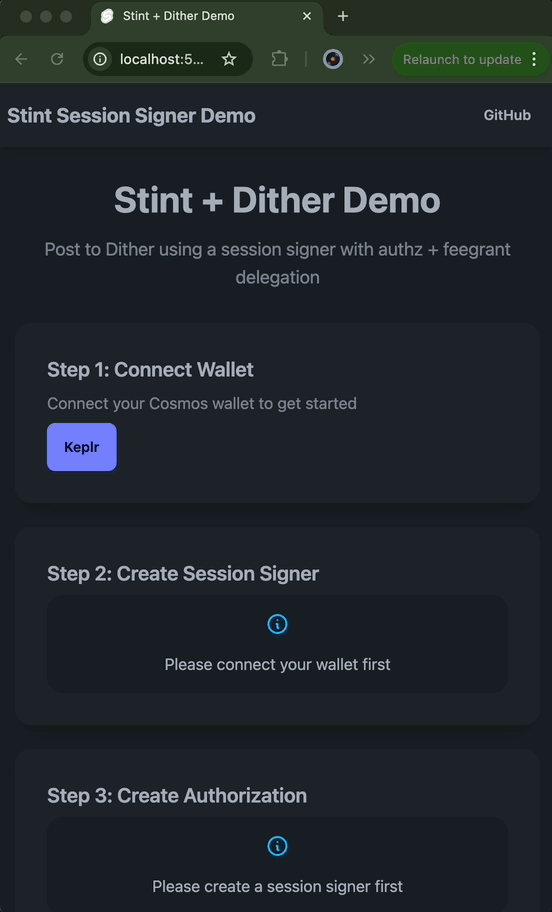

# Stint Dither Post Demo

A clean, modern demo of Stint session signers built with SvelteKit and DaisyUI. This example shows how to post to [Dither](https://testnet.dither.network), a decentralized social network, without wallet popups on every interaction.



> **⚠️ EXPERIMENTAL SOFTWARE - TESTNET ONLY**
>
> This is a demonstration of experimental software that has NOT been security audited. Only use on testnets with test tokens that have no real value. Do not use with real funds or in production environments.

## Features

- 🎨 **Modern UI** with DaisyUI components
- 🧩 **Modular Components** for wallet connection, session signer creation, authorization, and transactions
- 📱 **Responsive Design** that works on desktop and mobile
- 🔧 **Type Safety** with full TypeScript support
- ⚡ **Fast Development** with SvelteKit hot reload

## Getting Started

1. **Install dependencies:**
   ```bash
   pnpm install
   ```

2. **Start development server:**
   ```bash
   pnpm dev
   ```

3. **Open browser:**
   Navigate to http://localhost:5173

## How to Use

1. **Connect Wallet** - Connect Keplr, Leap, or Cosmostation
2. **Create Session Signer** - Generate a session signer using your device's biometrics (Passkey)
3. **Set Up Permissions** - Authorize the session signer to post on your behalf (one-time setup)
4. **Post Instantly** - Post messages to Dither without wallet popups!

## What's Happening Under the Hood

This demo showcases the power of session signers with a simplified API:

### Key Benefits

- **Zero Balance Required**: Session signer never holds funds
- **Automatic Gas Payment**: Primary wallet covers all transaction fees via feegrant
- **Simplified API**: Complex blockchain operations are abstracted away
- **Seamless UX**: Post to social networks without constant wallet popups

### How Dither Posting Works

Dither posts are small token transfers with your message in the memo field:

```typescript
// This simple call handles all the complexity:
await sessionSigner.execute.send({
  toAddress: DITHER_ADDRESS,
  amount: [{ denom: 'uphoton', amount: '100' }], // Minimal required amount
  memo: 'Hello Dither! 🚀' // Your post content
})
```

**Behind the scenes:**
1. Creates a MsgSend transaction
2. Wraps it in MsgExec for authz delegation
3. Signs with session signer
4. Uses feegrant for gas fees
5. Transfers funds from your primary wallet

## Project Structure

```
src/
├── lib/
│   ├── components/        # Svelte components
│   │   ├── WalletConnect.svelte
│   │   ├── SessionSigner.svelte
│   │   ├── Authorization.svelte
│   │   └── Transaction.svelte
│   ├── stores/           # Svelte stores
│   │   └── session.ts
│   └── utils/            # Utilities
│       ├── wallets.ts
│       └── polyfill.ts
├── routes/               # SvelteKit routes
│   ├── +layout.svelte
│   └── +page.svelte
└── app.css              # Global styles
```

## Tech Stack

- **[SvelteKit](https://kit.svelte.dev)** - Modern web framework
- **[DaisyUI](https://daisyui.com)** - Beautiful Tailwind CSS components
- **[TypeScript](https://www.typescriptlang.org)** - Type safety
- **[Stint](https://github.com/n2p5/stint)** - Session signer library
- **[CosmJS](https://github.com/cosmos/cosmjs)** - Cosmos SDK client
- **[AtomOne](https://atomone.zone)** - Cosmos-based blockchain

## Build for Production

```bash
pnpm build
```

This will create a static build in the `build/` directory that can be served by any static hosting provider.